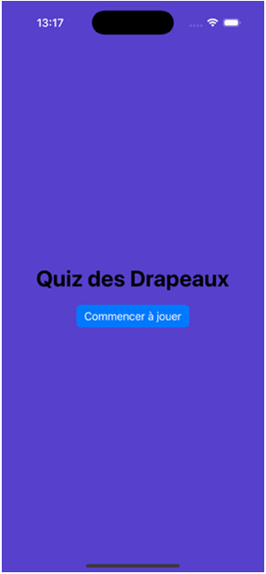
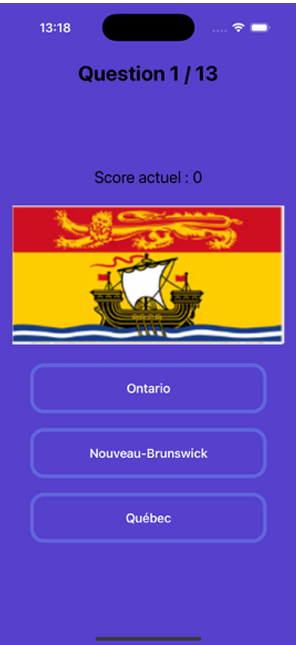
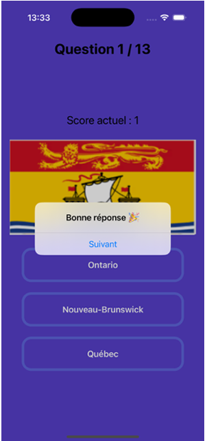
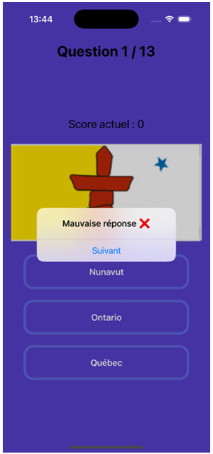
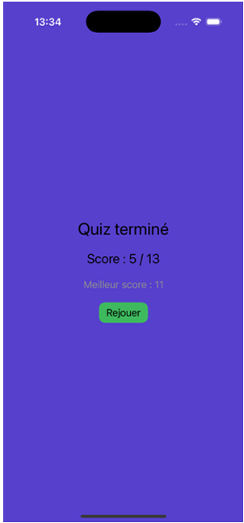

# 🍁 Quiz des Drapeaux Provinciaux Canadien

> Application iOS interactive pour tester ses connaissances sur les drapeaux des provinces et territoires du Canada.

## 📸 Aperçu

| Accueil | Question | Bonne réponse | Mauvaise réponse | Résultat final |
|:---:|:---:|:---:|:---:|:---:|
|  |  |  |  |  |

---

## 📋 Description

Ce projet est une application iOS interactive de quiz portant sur les drapeaux des provinces et territoires canadiens. L'utilisateur est invité à identifier le bon territoire parmi plusieurs choix, à partir de l'image de son drapeau.

## 🎯 Objectifs du projet

- Tester les connaissances des utilisateurs sur les drapeaux des provinces et territoires canadiens
- Offrir une expérience d'apprentissage interactive et ludique
- Fournir des informations éducatives sur les symboles régionaux du Canada

## 🚀 Installation

1. **Cloner le dépôt**

    ```bash
    git clone <url-du-depot>
    ```

2. **Accéder au répertoire du projet**

    ```bash
    cd Canadian_flag_Quiz
    ```

3. **Ouvrir le projet Xcode**

    ```bash
    open Quiz_Drapeau/Quiz_Drapeau.xcodeproj
    ```

4. **Lancer l'application**

    Sélectionnez un simulateur iPhone dans Xcode, puis appuyez sur **⌘ + R**.

## 📁 Structure du projet

```
Canadian_flag_Quiz/
│
├── Quiz_Drapeau/
│   └── Quiz_Drapeau/
│       ├── Quiz_DrapeauApp.swift       # Point d'entrée de l'app
│       ├── MainView.swift              # Vue principale / navigation
│       ├── ContentView.swift           # Écran d'accueil
│       ├── QuestionPageTemplate.swift  # Template d'une question
│       ├── Questions.swift             # Données des questions
│       ├── LastPageView.swift          # Écran de résultat final
│       └── Assets.xcassets/            # Images des drapeaux
│           └── Images/                 # 13 drapeaux (provinces + territoires)
├── screenshots/                        # Captures d'écran de l'application
└── README.md                           # Documentation du projet
```

## 🛠️ Technologies utilisées

| Technologie | Utilisation |
|-------------|-------------|
| **Swift** | Langage de programmation principal |
| **SwiftUI** | Framework d'interface utilisateur |
| **Xcode** | Environnement de développement (IDE) |

## 💡 Fonctionnalités

- ✅ 13 questions — une par province et territoire canadien
- ✅ Identification du drapeau parmi 3 choix (QCM)
- ✅ Affichage du score en temps réel
- ✅ Feedback immédiat sur les réponses (Bonne réponse 🎉 / Mauvaise réponse ❌)
- ✅ Écran de résultat final avec meilleur score sauvegardé
- ✅ Possibilité de rejouer

## 🖥️ Utilisation

1. Lancez l'application sur un iPhone ou simulateur iOS
2. Appuyez sur **Commencer à jouer**
3. Identifiez le drapeau affiché parmi les 3 réponses proposées
4. Consultez votre score à la fin des 13 questions
5. Recommencez pour battre votre meilleur score !

## 👤 Auteur

- **Nom** : Kryss Rayane
- **github** : [KryssSampi](github.com/kryssSampi)

## 📄 Licence

Ce projet est réalisé dans un cadre académique. Tous droits réservés.

---

> 🍁 *« Le drapeau est le symbole de l'unité de la nation, car il représente, sans aucun doute, tous les citoyens du Canada. »*
